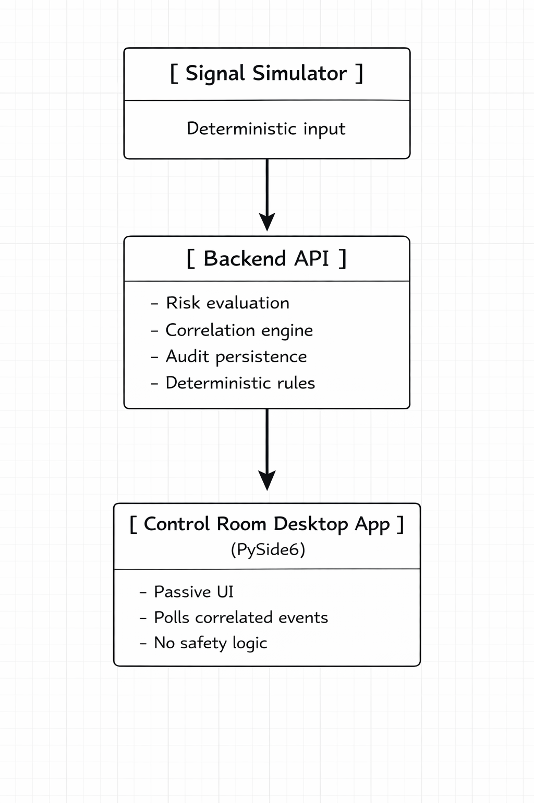
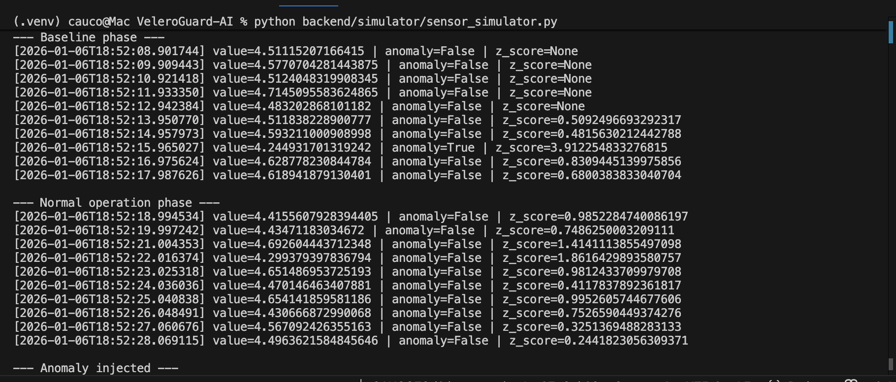
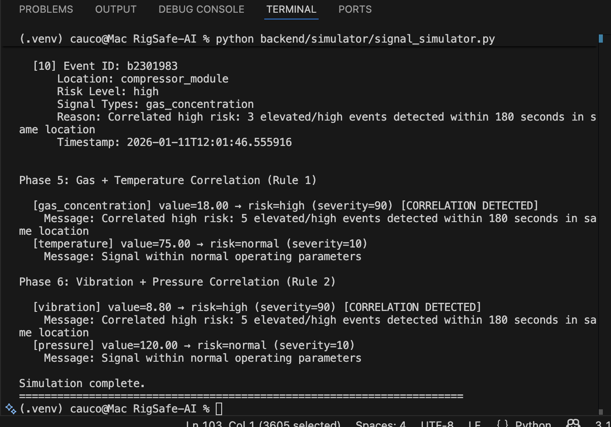
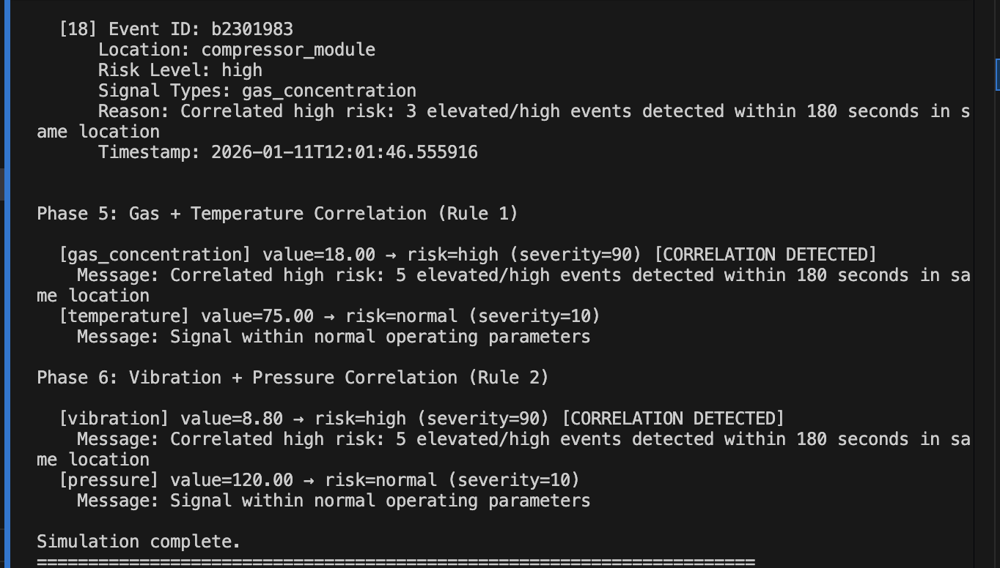
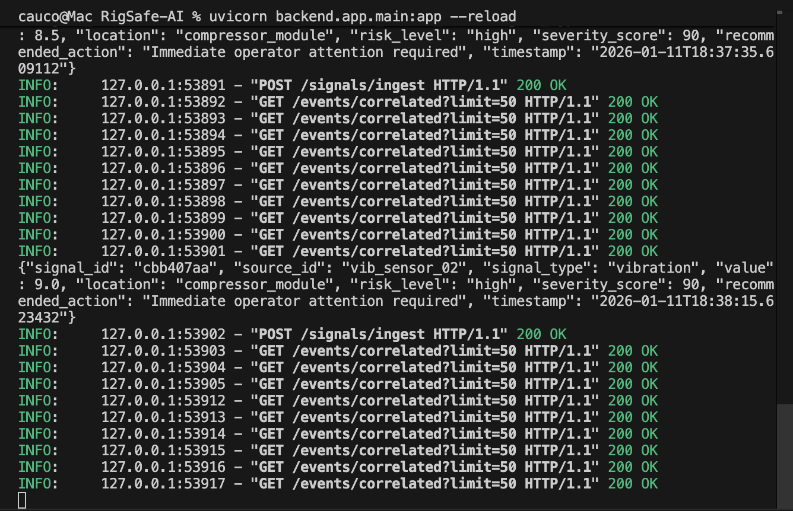
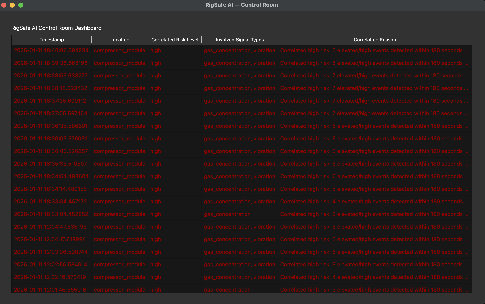

# RigSafe-AI
**Offline-first safety monitoring and anomaly detection platform for offshore oil & gas operations**

---
## 🛢️ Overview

RigSafe AI is an open-source safety monitoring platform designed for offshore oil and gas operations, with a strong focus on **early hazard detection**, **situational awareness**, and **operator support** in control room environments.

The system ingests data from multiple industrial sensors (gas, vibration, temperature, pressure, structural monitoring) and applies edge-based intelligence to identify abnormal patterns that may indicate emerging safety risks.

RigSafe AI is designed to complement existing safety systems by providing **contextual analysis**, **risk prioritization**, and **offline-first operation**, helping operators reduce alarm fatigue and respond more effectively to critical situations.

RigSafe AI is intentionally deterministic and explainable.
All safety insights are produced through explicit, auditable rules rather than opaque machine learning models.

This design choice prioritizes operator trust, traceability, and regulatory compatibility in safety-critical environments.

---

## 🎯 Project Objectives

- Assist control room operators in identifying hazardous and abnormal conditions at an early stage
- Reduce alarm overload by prioritizing and contextualizing safety-relevant signals
- Correlate data from multiple sensor sources to detect emerging risk patterns
- Provide clear, actionable safety insights without overwhelming the operator
- Operate reliably in environments with limited or intermittent connectivity

---

## 🧠 Key Safety Use Cases (MVP)

- Gas leak detection support (H₂S, CH₄)
- Abnormal vibration and structural stress patterns
- Temperature and pressure deviations
- Multi-sensor risk correlation
- Safety alert prioritization for control rooms

---

## 🚨 Safety Challenges Addressed

RigSafe AI focuses on safety challenges that are often difficult to detect using traditional threshold-based systems:

- Early-stage gas release patterns (H₂S, CH₄) before critical alarms are triggered
- Alarm fatigue in control rooms caused by excessive low-priority alerts
- Gradual vibration and structural stress patterns leading to mechanical failure
- Abnormal temperature and pressure trends that remain within nominal limits
- Correlated multi-sensor anomalies indicating emerging or cascading failures

The platform is designed to surface **early warning signals** and **contextual risk indicators**, supporting operators in making informed safety decisions.

---

## 🏗️ System Architecture (High Level)

RigSafe AI follows a layered architecture designed for safety-critical environments, where reliability, clarity, and operator support are prioritized.



**1. Sensor & Signal Layer**  
Industrial sensors provide continuous data streams related to gas concentration, vibration, temperature, pressure, and structural behavior.

**2. Edge Intelligence Layer**  
Edge components preprocess sensor data, maintain sliding windows, and perform local anomaly detection. This layer is designed to operate offline with low latency and minimal computational overhead.

**3. Safety Logic & Correlation Layer**  
Detected anomalies and signals are correlated across multiple data sources to identify emerging safety risks and abnormal operating patterns.

**4. Control Room Interface**  
A desktop application presents safety insights to control room operators, prioritizing clarity, context, and actionable information while avoiding alarm overload.

---

## 🛥️ Onboard & Control Room Architecture

RigSafe AI is designed to operate across two primary environments: the offshore platform (edge) and the control room.

**On-Platform (Edge Layer)**  
Edge components are deployed close to industrial sensors on the platform. This layer handles data ingestion, local buffering, preprocessing, and early anomaly detection. It is designed to operate independently of external connectivity and continue functioning during network interruptions.

**Control Room (Desktop Application)**  
The control room application aggregates safety signals from the platform, correlates multi-sensor events, and presents prioritized safety insights to operators. The interface focuses on clarity, context, and decision support rather than raw alarm generation.

**Communication Layer**  
Data exchange between the platform and the control room is designed to be resilient and tolerant to intermittent connectivity. When connectivity is available, historical data and contextual information are synchronized without impacting real-time operation.

---

## 📸 Screenshots

### Signal Simulator — Risk Progression & Escalation
The deterministic simulator drives a controlled baseline, then steps through elevated risk and escalation states. Each transition is scripted and repeatable to validate downstream behavior and operator response timing.



---

### Signal Simulator — Correlation Scenarios
Multiple deterministic scenarios demonstrate how individual signals combine into correlated safety events. Each scenario is designed to exercise a specific correlation rule.



---

### Correlation Engine — Rule-Based Execution
Explicit, explainable correlation rules are evaluated against the incoming signal stream. Rule execution and trigger conditions are visible and traceable for audit and validation purposes.



---

### Backend API — Live Correlated Events
The FastAPI backend exposes correlated safety events via a deterministic endpoint. All responses preserve provenance for audit logging, replay, and post-incident analysis.



---

### Desktop Application — Control Room Dashboard
The PySide6 desktop control room dashboard displays live correlated events without embedding business logic. The UI remains a passive consumer of audited backend data.

The desktop application intentionally avoids embedding safety logic, ensuring that all risk assessment remains centralized, auditable, and version-controlled in the backend.



---

## 🛠️ Technologies Used

RigSafe AI intentionally uses a focused and pragmatic technology stack suitable for safety-oriented and industrial environments.

| Layer | Technology | Rationale |
|------|-----------|-----------|
| Backend API | Python, FastAPI | Clear data models, strong validation, and fast development for safety-focused logic |
| Edge Intelligence | Python (statistics / ML-ready) | Lightweight, explainable anomaly detection and signal processing |
| Desktop Application | PySide6 (Qt) | Native control room UI (current MVP) |
| Alternative UI | Electron (optional) | Possible future cross-platform variant |
| Communication | HTTP / MQTT (planned) | Reliable data ingestion and sensor communication patterns |
| Data Storage | In-memory (MVP), time-series DB (planned) | Simple MVP storage with a clear path to scalable time-series persistence |
| Tooling | GitHub, Docker (planned) | Version control, reproducibility, and deployment consistency |

The technology choices prioritize **clarity, reliability, and maintainability** over unnecessary complexity.

---

## 🚀 Installation & Setup

The current MVP focuses on the backend safety logic and signal ingestion layer.

### Prerequisites
- Python 3.10+
- Git

### Clone the repository

```bash
git clone https://github.com/CAUCORASEKO/RigSafe-AI.git
cd RigSafe-AI
```
### Create and activate a virtual environment

```bash
python -m venv .venv
source .venv/bin/activate
```

### Install backend dependencies

```bash
pip install -r backend/requirements.txt
```

### Start the backend server

```bash
cd backend
uvicorn app.main:app --reload
```

### Once running, the API will be available at:

```bash
http://127.0.0.1:8000
```
---

## 📡 Usage Example

The following example demonstrates how a safety-relevant signal can be ingested into the RigSafe AI backend.

### Ingest a safety signal

```bash
curl -X POST http://127.0.0.1:8000/signals/ingest \
  -H "Content-Type: application/json" \
  -d '{
    "source_id": "gas_sensor_module_01",
    "signal_type": "gas_concentration",
    "value": 18.4,
    "unit": "ppm",
    "location": "compressor_module",
    "timestamp": "2026-01-06T15:30:00Z"
  }'
  ```

### Example response

```json
{
  "status": "accepted",
  "signal_id": "a3f21c1e",
  "risk_level": "elevated",
  "message": "Gas concentration trend deviates from baseline",
  "timestamp": "2026-01-06T15:30:01Z"
}
```

### This response represents a safety insight, not a critical alarm.
### RigSafe AI does not replace certified safety systems (SIS/ESD), but provides early     
### indicators to support operator decision-making.
### Final operational decisions remain with the control room operator.

---

## 🧩 Design Decisions & Safety Rationale

RigSafe AI is intentionally designed as a **decision-support system**, not as a replacement for certified safety systems (SIS / ESD).

Several architectural and design decisions were made explicitly to align with safety-critical, industrial environments:

### Deterministic & Explainable Logic
All risk assessments and correlations are produced through explicit, rule-based logic.
No opaque machine learning models are used in the MVP.

This ensures:
- Full traceability from input signals to safety insights
- Predictable system behavior
- Easier validation, audit, and regulatory review
- Higher operator trust in control room environments

### Separation of Concerns
The system enforces a strict separation between:
- **Signal ingestion & correlation logic** (backend)
- **Visualization & operator interaction** (desktop application)

The desktop UI contains **no safety logic**.  
It consumes audited backend data only, preventing hidden or duplicated decision paths.

### Correlation Only Escalates Risk
Correlation rules are designed to **only increase** risk levels, never reduce them.
This conservative approach avoids masking individual hazards and aligns with
safety engineering principles.

### Offline-First Philosophy
Core logic is designed to operate with limited or intermittent connectivity.
This reflects real offshore conditions where network availability cannot be assumed.

### Auditability by Design
All elevated and high-risk events are:
- Logged in structured format
- Persisted with timestamps and provenance
- Replayable for post-incident analysis

This supports safety investigations, learning cycles, and continuous improvement.

---

## 🛣️ Roadmap (Post-MVP)

The current MVP focuses on architectural clarity and safety logic foundations.
Future iterations may include:

### v0.2 — Operator Interaction & Traceability
- Operator acknowledgment of correlated events
- Free-text operator notes attached to safety events
- Event state lifecycle (new → acknowledged → resolved)

### v0.3 — Rule Management & Governance
- Versioned correlation rules
- Rule enable/disable without redeploy
- Rule execution metadata for audit purposes

### v0.4 — Data & Persistence
- Time-series database integration
- Historical trend visualization
- Exportable audit reports (CSV / JSON)

### v0.5 — Deployment & Integration
- Containerized backend (Docker)
- MQTT ingestion for live sensor feeds
- Role-based access for control room operators

All roadmap items prioritize **clarity, determinism, and operator trust**
over complexity or automation.

---


## 🚧 Project Status

Early-stage MVP focused on architecture and safety logic.

---

## 📄 License

MIT License
